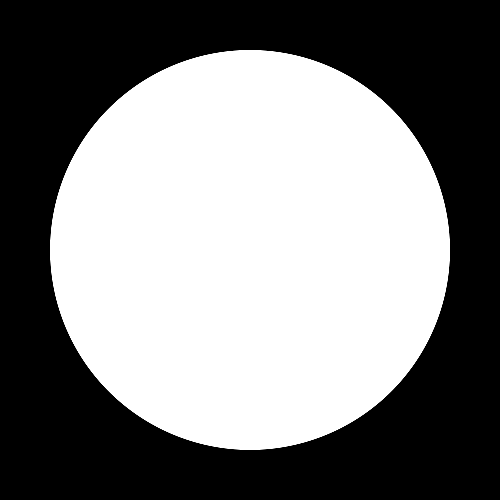
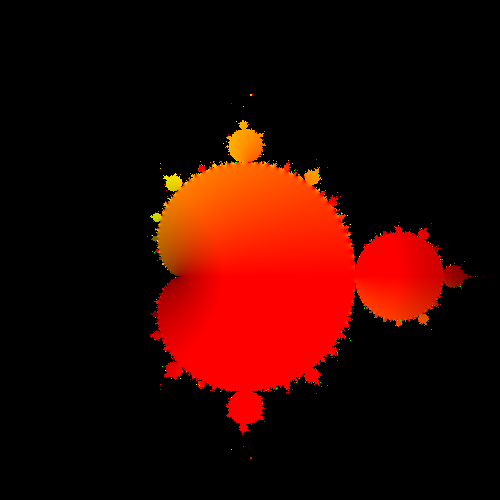
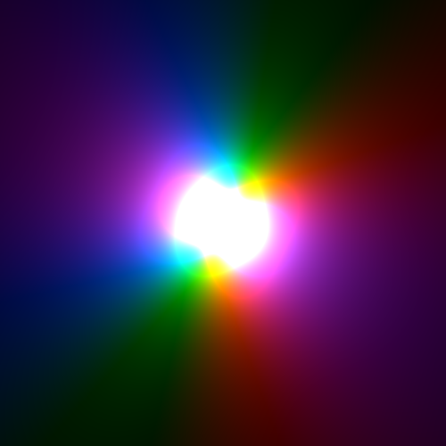
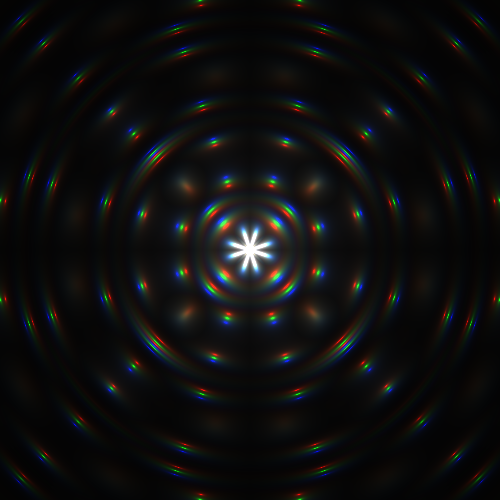
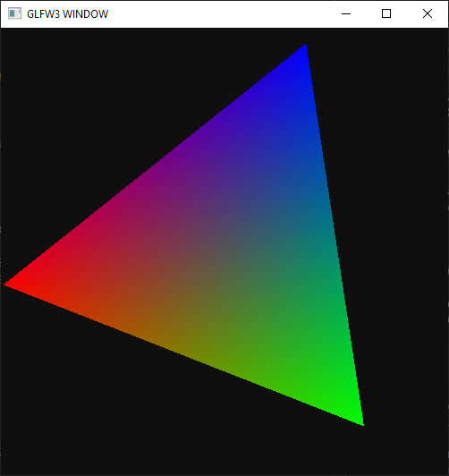
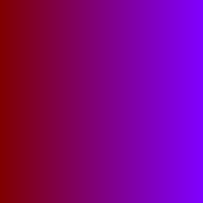

# Nim to GPU shader language compiler and supporting utilities.

Shady can compile a subset of Nim into `OpenGL Shader Language` used by the GPU. This allows you to test your shader code with `echo` statements on the CPU and then run the exact same code on the GPU.

`nimble install shady`


[API reference](https://treeform.github.io/shady)

Shady has two main goals:

* Write vertex and fragment/pixel shaders for games and 3d applications.
* Write compute shaders for offline processing and number crunching.

Currently supported shader types:

* Fragment/pixel shaders, including shader-toy style fullscreen examples.
* Vertex shaders paired with fragment shaders for the traditional graphics pipeline.
* Compute shaders for GPU data processing.

Current GLSL targets:

* Desktop GLSL via `glslDesktop` for OpenGL 4.1+.
* GLSL ES 3.0 via `glslES3` for OpenGL ES 3.0 / WebGL 2.0.

Shady uses:
* `pixie` library for image operations.
* `vmath` library for vector and matrix operations.
* `chroma` library for color conversions and operations.
* `bumpy` library for collisions and intersections.

# Using Shady shader toy playground:



```nim
import shady, vmath, shady/demo

# both CPU and GPU code:
proc circleSmooth(fragColor: var Vec4, uv: Vec2, time: Uniform[float32]) =
  var a = 0.0
  var radius = 300.0 + 100 * sin(time)
  for x in 0 ..< 8:
    for y in 0 ..< 8:
      if (uv + vec2(x.float32 - 4.0, y.float32 - 4.0) / 8.0).length < radius:
        a += 1
  a = a / (8 * 8)
  fragColor = vec4(a, a, a, 1)

# test on the CPU:
var testColor: Vec4
circleSmooth(testColor, vec2(100, 100), 0.0)
echo testColor

# compile to a GPU shader:
var shader = toGLSL(circleSmooth)
echo shader

# run the GPU shader and display it in a window:
run("Circle", shader)
```

[See the source](examples/circle.nim)



[See the source](examples/mandelbrot.nim)



[See the Source](examples/colors.nim)



[See the Source](examples/flare.nim)


# Using Shady as a shader generator:



[See the source](examples/triangle.nim)

Nim vertex shader:
```nim
proc basicVert(
  gl_Position: var Vec4,
  MVP: Uniform[Mat4],
  vCol: Vec3,
  vPos: Vec3,
  vertColor: var Vec3
) =
  gl_Position = MVP * vec4(vPos.x, vPos.y, 0.0, 1.0)
  vertColor = vCol
```

GLSL output:
```glsl
#version 410
precision highp float;

uniform mat4 MVP;
attribute vec3 vCol;
attribute vec3 vPos;
out vec3 vertColor;

void main() {
  gl_Position = MVP * vec4(vPos.x, vPos.y, 0.0, 1.0);
  vertColor = vCol;
}
```

Nim fragment shader:
```nim
proc basicFrag(fragColor: var Vec4, vertColor: Vec3) =
  fragColor = vec4(vertColor.x, vertColor.y, vertColor.z, 1.0)
```

GLSL output:
```glsl
#version 410
precision highp float;

in vec3 vertColor;

void main() {
  gl_FragColor = vec4(vertColor.x, vertColor.y, vertColor.z, 1.0);
}
```

# Using Shady to write compute shaders:

Shady can be used to write compute shaders. Compute shaders allow more general purpose code execution work in parallel and are often faster than the CPU for this kind of workload.

```nim
# Setup the uniforms.
var inputCommandBuffer*: Uniform[SamplerBuffer]
var outputImageBuffer*: UniformWriteOnly[UImageBuffer]
var dimensions*: Uniform[IVec4] # ivec4(width, height, 0, 0)

# The shader itself.
proc commandsToImage() =
  var pos = gl_GlobalInvocationID
  for x in 0 ..< dimensions.x:
    pos.x = x.uint32
    let value = uint32(texelFetch(inputCommandBuffer, int32(pos.x)).x)
    #echo pos.x, " ", value
    let colorValue = uvec4(
      128,
      0,
      value,
      255
    )
    imageStore(outputImageBuffer, int32(pos.y * uint32(dimensions.x) + pos.x), colorValue)
```

#### GPU:



#### CPU:


[See the Source](examples/compute1.nim)
